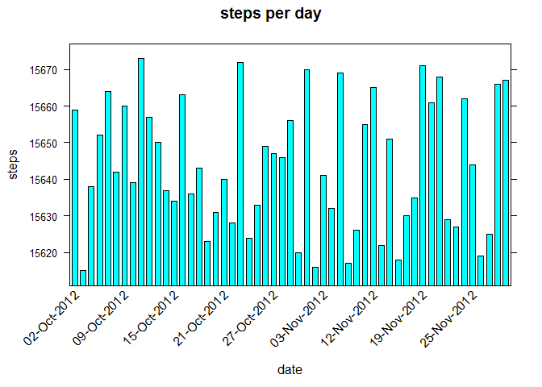
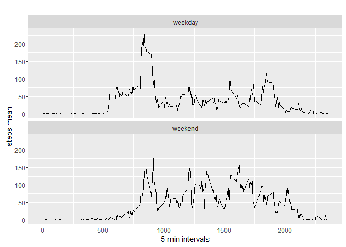

# Reproducible Research: Peer Assessment 1


## Loading and preprocessing the data

Show any code that is needed to 

1. Load the data (i.e. read.csv())

2. Process/transform the data (if necessary) into a format suitable for your analysis


```r
setwd("~/Downloads/Courses/Data Science/R_working_directory/Course5_Week2")

library(httr)
library(plyr)
library(lattice)
library(ggplot2)

zipURL <- "https://d396qusza40orc.cloudfront.net/repdata%2Fdata%2Factivity.zip"
data <- "data"
if(!file.exists(data)){
  dir.create(data)
} 

zipfile <- paste0(getwd(), "/activity.zip")
if(!file.exists(zipfile)){
	download.file(zipURL, zipfile, method="auto", mode="wb")
}
datafile <- paste0(getwd(), "/data/activity.csv")
if(!file.exists(datafile)){
	unzip(zipfile, list = FALSE, overwrite = FALSE, exdir = data)
}

activity <- read.csv(file = datafile, header = TRUE)
```

## What is mean total number of steps taken per day?

For this part of the assignment, you can ignore the missing values in the dataset.

1. Make a histogram of the total number of steps taken each day

2. Calculate and report the mean and median total number of steps taken per day


```r
activity$datetime <- as.POSIXct(with(activity, paste(date, paste(interval %/% 100, interval %% 100, sep=":"))),
    format="%Y-%m-%d %H:%M",tz="")

walking <- setNames(aggregate(steps~as.Date(date), activity, sum, na.rm = TRUE), c("date","steps"))

xaxis <- seq(1, nrow(walking), by = 6)

okscale <- list(x = list(rot = 45, cex = 1.0, labels = format(walking$date, "%d-%b-%Y")[xaxis], at = xaxis))
# barchart works to create a histogram since each separate day is "categorical"
barchart(date ~ steps, data = walking, main = "steps per day", ylab = "steps", xlab = "date", scales = okscale, horizontal = F)
```

<!-- -->

```r
paste0("mean walking steps: ", mean(walking$steps))
```

```
## [1] "mean walking steps: 10766.1886792453"
```

```r
paste0("median walking steps: ", median(walking$steps))
```

```
## [1] "median walking steps: 10765"
```

## What is the average daily activity pattern?

1. Make a time series plot (i.e. type = "l") of the 5-minute interval (x-axis) and the average number of steps taken, averaged across all days (y-axis)

2. Which 5-minute interval, on average across all the days in the dataset, contains the maximum number of steps?


```r
timeseries <- aggregate(steps ~ interval, data = activity, FUN = mean)
plot(timeseries, type = "l", axes = F, xlab = "Time of the day", 
    ylab = "Average across all days provided a time", main = "Average number of steps taken", 
    col = "red")
axis(1,at=c(seq(0,2400,100),835), label = paste(c(seq(0,24,1),8),c(rep(":00",25),":40"),sep=""), pos = 0)
axis(2, at=c(seq(0,210,30),206.2), label = c(seq(0,210,30),206.2), pos = 0)
maximum <- which.max(timeseries$steps)
segments(832, 0, 832, 206.2, col = "blue", lty = "dashed")
text(835,200, "max average of steps: (832,206.2)", col = "blue", adj = c(-.1, -.1))
segments(0, 206.2, 832, 206.2, col = "blue", lty = "dashed")
```

<!-- -->

```r
timeseries [maximum, ]
```

```
##     interval    steps
## 104      835 206.1698
```

```r
paste(835, "as the interval of the maximum is equivalent to 8.667 hours ~ 8:40 am")
```

```
## [1] "835 as the interval of the maximum is equivalent to 8.667 hours ~ 8:40 am"
```

## Impute missing values

Note that there are a number of days/intervals where there are missing values (coded as NA). The presence of missing days may introduce bias into some calculations or summaries of the data.

1. Calculate and report the total number of missing values in the dataset (i.e. the total number of rows with NAs)

2. Devise a strategy for filling in all of the missing values in the dataset. The strategy does not need to be sophisticated. For example, you could use the mean/median for that day, or the mean for that 5-minute interval, etc.

3. Create a new dataset that is equal to the original dataset but with the missing data filled in.

4. Make a histogram of the total number of steps taken each day and Calculate and report the mean and median total number of steps taken per day. Do these values differ from the estimates from the first part of the assignment? What is the impact of imputing missing data on the estimates of the total daily number of steps?


```r
paste0("Number of missing observations: ", sum(is.na(activity$steps)))
```

```
## [1] "Number of missing observations: 2304"
```

```r
"missing observations can be replaced with the sample mean  - the preferred method of interpolating from adjacent values won't work as in some cases large blocks of intervals don't have measured values"
```

```
## [1] "missing observations can be replaced with the sample mean  - the preferred method of interpolating from adjacent values won't work as in some cases large blocks of intervals don't have measured values"
```

```r
activity2 <- activity
activity2[is.na(activity$steps), ]$steps <- mean(activity$steps)

activity2$datetime <- as.POSIXct(with(activity2, paste(date, paste(interval %/% 100, interval %% 100, sep=":"))),
    format="%Y-%m-%d %H:%M",tz="")

walking2 <- setNames(aggregate(steps~as.Date(date), activity2, sum, na.rm = TRUE), c("date","steps"))

xaxis <- seq(1, nrow(walking2), by = 6)

okscale2 <- list(x = list(rot = 45, cex = 1.0, labels = format(walking2$date, "%d-%b-%Y")[xaxis], at = xaxis))

# barchart works to create a histogram since each separate day is "categorical"
barchart(date ~ steps, data = walking2, main = "steps per day", ylab = "steps", xlab = "date", scales = okscale2, horizontal = F)
```

<!-- -->

```r
paste0("mean walking steps: ", mean(walking2$steps))
```

```
## [1] "mean walking steps: 10766.1886792453"
```

```r
paste0("median walking steps: ", median(walking2$steps))
```

```
## [1] "median walking steps: 10765"
```

```r
paste0("mean difference in walking steps: ", mean(walking2$steps)-mean(walking$steps))
```

```
## [1] "mean difference in walking steps: 0"
```

```r
paste0("median difference in walking steps: ", median(walking2$steps)-median(walking$steps))
```

```
## [1] "median difference in walking steps: 0"
```

## Are there differences in activity patterns between weekdays and weekends?

For this part the weekdays() function may be of some help here. Use the dataset with the filled-in missing values for this part.

1. Create a new factor variable in the dataset with two levels - "weekday" and "weekend" indicating whether a given date is a weekday or weekend day.

2. Make a panel plot containing a time series plot (i.e. type = "l") of the 5-minute interval (x-axis) and the average number of steps taken, averaged across all weekday days or weekend days (y-axis). The plot should look something like the following, which was creating using simulated data:
Your plot will look different from the one above because you will be using the activity monitor data. Note that the above plot was made using the lattice system but you can make the same version of the plot using any plotting system you choose.


```r
str(activity2)
```

```
## 'data.frame':	17568 obs. of  4 variables:
##  $ steps   : num  NA NA NA NA NA NA NA NA NA NA ...
##  $ date    : Factor w/ 61 levels "2012-10-01","2012-10-02",..: 1 1 1 1 1 1 1 1 1 1 ...
##  $ interval: int  0 5 10 15 20 25 30 35 40 45 ...
##  $ datetime: POSIXct, format: "2012-10-01 00:00:00" "2012-10-01 00:05:00" ...
```

```r
activity2$date <- as.Date(activity2$date, "%Y-%m-%d")
activity2$day <- weekdays(activity2$date)
activity2$weekdayweekend <- c("weekday") # default is weekday
# change weekdayweekend value to "weekend" if on Saturday or Sunday
for (i in 1:nrow(activity2)){
  if (activity2$day[i] == "Saturday" || activity2$day[i] == "Sunday"){
    activity2$weekdayweekend[i] <- "weekend"
  }
}
activity2$weekdayweekend <- as.factor(activity2$weekdayweekend)
weekorweekend <- aggregate(steps ~ interval+weekdayweekend, activity2, mean)
qplot(interval, steps, data=weekorweekend, geom=c("line"), xlab="5-min intervals", 
      ylab="steps mean", main="") + facet_wrap(~ weekdayweekend, ncol=1)
```

<!-- -->
